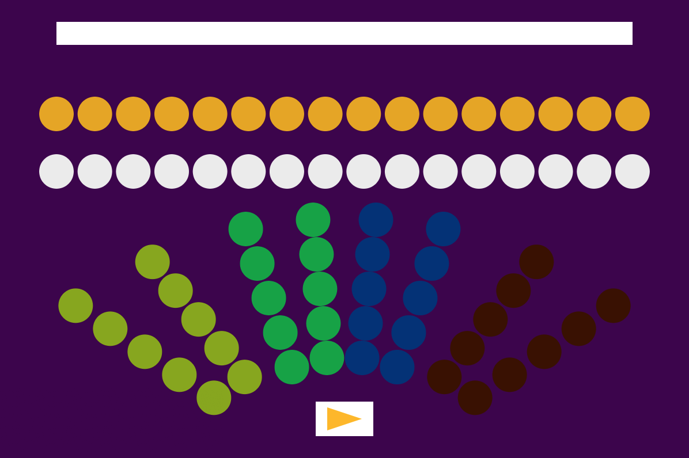

# Interavtive Music director Game
Description. Describe the importance of your project, and what it does. Include a screen shot.

Usage. Press the Play button to play audio; hover your mouse above each section of color to take control; use up/down keys on your keyboard to adjust volume. Enjoy your own direction!

Authors: Hubert Yumeng Lu, Jarah Romero

Acknowledgements. Acknowledge the source of code and assets, any help you got, and work that inspired the project.

## License

MIT
